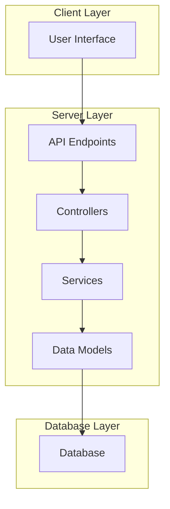
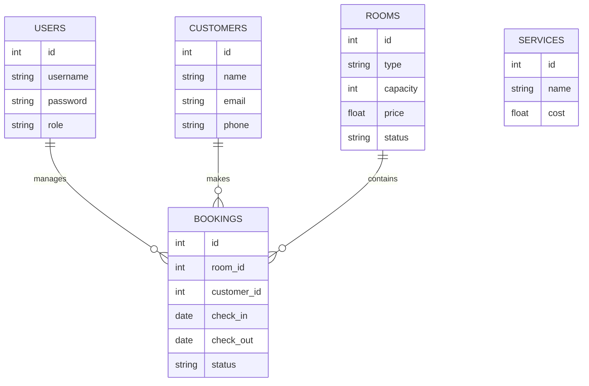

# Royal-Hotel

A comprehensive hotel management system designed to handle reservations, customer management, room services, and administrative tasks. The repository provides a complete backend and frontend solution for managing a hotel's daily operations efficiently.

---

## Table of Contents

- [Project Overview](#project-overview)
- [Architecture](#architecture)
- [Installation](#installation)
- [Configuration](#configuration)
- [Database Schema](#database-schema)
- [Core Features](#core-features)
- [API Documentation](#api-documentation)
- [Usage](#usage)
- [Folder Structure](#folder-structure)
- [Contributing](#contributing)
- [License](#license)

---

## Project Overview

Royal-Hotel is a management system built for small to medium-sized hotels. It provides tools for managing bookings, customers, rooms, and staff. The system features user authentication, an admin dashboard, and various management modules.

---

## Architecture

The system implements a layered architecture, separating concerns between presentation, business logic, and data access. It uses a combination of frontend and backend technologies.



---

## Installation

Follow these steps to set up the Royal-Hotel project on your local machine:

1. Clone the repository:
   ```bash
   git clone https://github.com/Sehar-1207/Royal-Hotel.git
   cd Royal-Hotel
   ```
2. Install backend dependencies:
   ```bash
   npm install
   ```
3. Install frontend dependencies (if applicable):
   ```bash
   cd client
   npm install
   cd ..
   ```
4. Set up the database using the provided SQL scripts or ORM migrations.
5. Configure environment variables as described below.

---

## Configuration

The application requires several configuration variables to operate correctly. These are typically stored in an `.env` file at the project root.

Common configuration options include:

- Database connection string
- API server port
- Authentication secrets

Example `.env` file:
```
DB_HOST=localhost
DB_USER=root
DB_PASS=password
DB_NAME=royal_hotel
PORT=3000
JWT_SECRET=your_secret_key
```

---

## Database Schema

The system uses a relational database to store hotel data. Key tables include:

- `users`: Stores user credentials and roles.
- `rooms`: Contains information about each room.
- `bookings`: Manages reservations and their statuses.
- `customers`: Contains customer details.
- `services`: Lists available hotel services.



---

## Core Features

- User authentication and authorization
- Room management (add, update, delete, view)
- Booking management (create, update, cancel)
- Customer management
- Service management (add-on services, billing)
- Admin dashboard with statistics and reporting

---

## Usage

Once installed and configured, start the backend server:

```bash
npm start
```

Access the admin dashboard and user interfaces through the web application. Use API endpoints for integration with other systems or frontends.

---

## Folder Structure

- `/controllers`: Handles HTTP requests and business logic.
- `/models`: Contains database schema definitions.
- `/routes`: Defines API endpoints and routes.
- `/middlewares`: Middleware functions for authentication and error handling.
- `/client`: Frontend application code (if present).
- `/config`: Configuration files.
- `/public`: Static assets (images, CSS, JS).

---

## Contributing

Contributions are welcome. To contribute:

- Fork the repository
- Create a new branch
- Commit your changes with descriptive messages
- Open a pull request

---

## License

This repository uses the MIT License. See the `LICENSE` file for full details.
